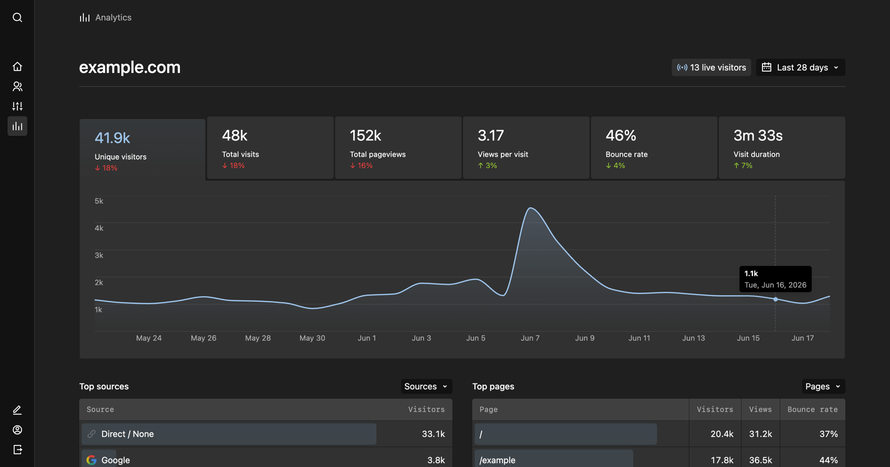

# Kirby Plausibly

A native [Plausible Analytics](https://plausible.io) dashboard for the Kirby Panel.

Adds an **Analytics** view to the Panel that mirrors the Plausible dashboard using native Kirby components.



## Features

- Six KPI stats (unique visitors, total visits, pageviews, views per visit, bounce rate, visit duration) with period-over-period change
- Visitors-over-time chart; click a KPI stat to chart that metric
- Breakdown cards with tabs: Top sources (Channels / Sources / Campaigns), Top pages (Top / Entry / Exit), Locations (Countries / Regions / Cities), Devices (Browser / OS / Size) and Goal conversions
- Live "current visitors" count
- Page rows link straight to the matching page in the Panel

## Requirements

- Kirby 5
- A Plausible instance (Cloud or self-hosted / Community Edition) with a **Stats API key**

## Installation

### Composer

```
composer require medienbaecker/kirby-plausibly
```

### Manual

Download and copy this repository to `site/plugins/kirby-plausibly`.

## Configuration

Create a Stats API key in your Plausible account settings, then add to `site/config/config.php`:

```php
return [
    'medienbaecker.plausibly.url'   => 'https://plausible.io', // your Plausible instance
    'medienbaecker.plausibly.site'  => 'example.com',          // the site_id / domain
    'medienbaecker.plausibly.token' => 'your-stats-api-key',
];
```

The Analytics view only appears once all three options are set. The API token stays on the server — the Panel talks only to the plugin's own API routes.

## Tracking

This plugin only renders the dashboard. To collect data, add Plausible's own tracking snippet to your site's `<head>` — copy it from your Plausible dashboard under **Site Settings → Installation**.

## Licensing

Kirby Plausibly is a commercial plugin. You can use it for free on local environments but using it in production requires a valid licence. You can pay what you want, the suggested price being 20€ per project. Feel free to choose "0" when working on a purposeful project ❤️

[Buy a licence](https://medienbaecker.com/plugins/plausibly)

## Credits

Inspired by [kirby-matomo](https://github.com/sylvainjule/kirby-matomo) by Sylvain Julé, which brought a native Matomo dashboard to the Panel. This plugin does the same for Plausible Analytics.
